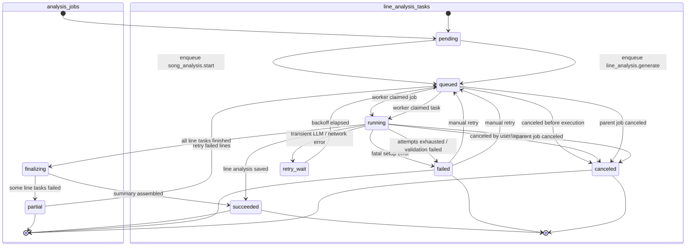
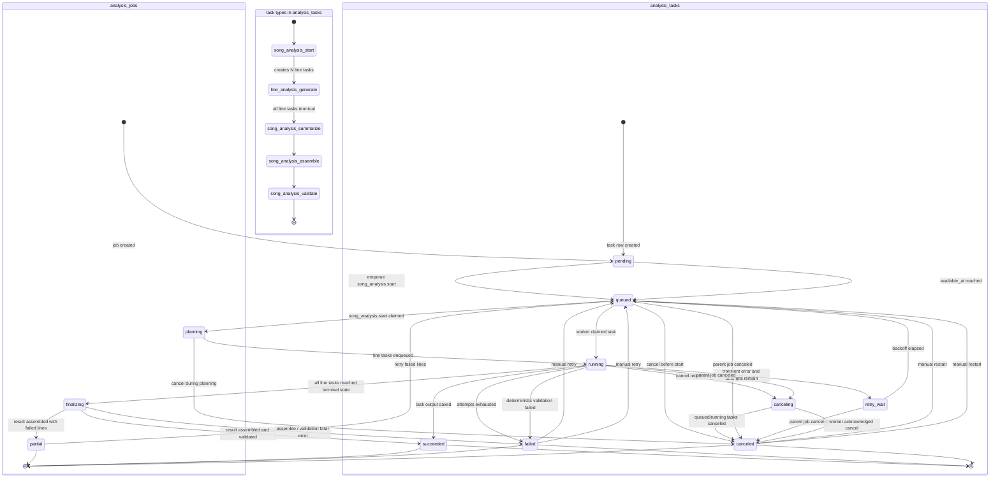

```mermaid
stateDiagram-v2
    direction TB

    state "analysis_jobs" as AJ {
        [*] --> pending
        pending --> queued: enqueue song_analysis.start
        queued --> running: worker claimed job
        running --> finalizing: all line tasks finished
        finalizing --> succeeded: summary assembled
        finalizing --> partial: some line tasks failed
        running --> failed: fatal setup error
        queued --> canceled: canceled before execution
        running --> canceled: canceled by user/admin
        partial --> queued: retry failed lines
        failed --> queued: manual retry
        succeeded --> [*]
        partial --> [*]
        failed --> [*]
        canceled --> [*]
    }

    state "line_analysis_tasks" as LT {
        [*] --> pending
        pending --> queued: enqueue line_analysis.generate
        queued --> running: worker claimed task
        running --> succeeded: line analysis saved
        running --> retry_wait: transient LLM / network error
        retry_wait --> queued: backoff elapsed
        running --> failed: attempts exhausted / validation failed
        queued --> canceled: parent job canceled
        running --> canceled: parent job canceled
        failed --> queued: manual retry
        succeeded --> [*]
        failed --> [*]
        canceled --> [*]
    }
```

第二版

```mermaid
stateDiagram-v2
    direction TB

    state "analysis_jobs" as AJ {
        [*] --> pending: job created

        pending --> queued: enqueue song_analysis.start
        queued --> planning: song_analysis.start claimed
        planning --> running: line tasks enqueued

        running --> finalizing: all line tasks reached terminal state
        finalizing --> succeeded: result assembled and validated
        finalizing --> partial: result assembled with failed lines
        finalizing --> failed: assemble / validation fatal error

        running --> canceling: cancel requested
        queued --> canceled: cancel before start
        planning --> canceled: cancel during planning
        canceling --> canceled: queued/running tasks canceled

        partial --> queued: retry failed lines
        failed --> queued: manual retry
        canceled --> queued: manual restart

        succeeded --> [*]
        partial --> [*]
        failed --> [*]
        canceled --> [*]
    }

    state "analysis_tasks" as AT {
        [*] --> pending: task row created

        pending --> queued: available_at reached
        queued --> running: worker claimed task

        running --> succeeded: task output saved
        running --> retry_wait: transient error and attempts remain
        retry_wait --> queued: backoff elapsed

        running --> failed: attempts exhausted
        running --> failed: deterministic validation failed

        queued --> canceled: parent job canceled
        retry_wait --> canceled: parent job canceled
        running --> canceling: parent job canceled
        canceling --> canceled: worker acknowledged cancel

        failed --> queued: manual retry
        canceled --> queued: manual restart

        succeeded --> [*]
        failed --> [*]
        canceled --> [*]
    }

    state "task types in analysis_tasks" as TT {
        [*] --> song_analysis_start
        song_analysis_start --> line_analysis_generate: creates N line tasks
        line_analysis_generate --> song_analysis_summarize: all line tasks terminal
        song_analysis_summarize --> song_analysis_assemble
        song_analysis_assemble --> song_analysis_validate
        song_analysis_validate --> [*]
    }
```