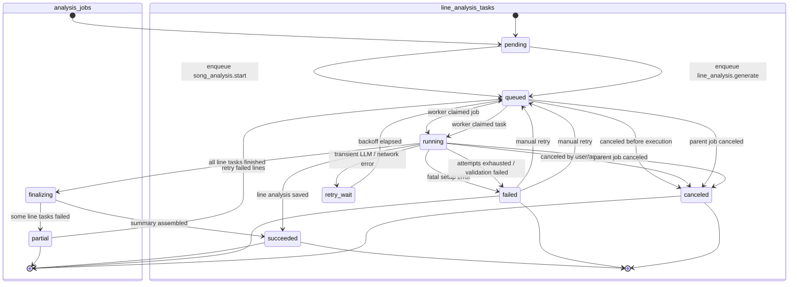

```mermaid
stateDiagram-v2
    direction TB

    state "analysis_jobs" as AJ {
        [*] --> pending
        pending --> queued: enqueue song_analysis.start
        queued --> running: worker claimed job
        running --> finalizing: all line tasks finished
        finalizing --> succeeded: summary assembled
        finalizing --> partial: some line tasks failed
        running --> failed: fatal setup error
        queued --> canceled: canceled before execution
        running --> canceled: canceled by user/admin
        partial --> queued: retry failed lines
        failed --> queued: manual retry
        succeeded --> [*]
        partial --> [*]
        failed --> [*]
        canceled --> [*]
    }

    state "line_analysis_tasks" as LT {
        [*] --> pending
        pending --> queued: enqueue line_analysis.generate
        queued --> running: worker claimed task
        running --> succeeded: line analysis saved
        running --> retry_wait: transient LLM / network error
        retry_wait --> queued: backoff elapsed
        running --> failed: attempts exhausted / validation failed
        queued --> canceled: parent job canceled
        running --> canceled: parent job canceled
        failed --> queued: manual retry
        succeeded --> [*]
        failed --> [*]
        canceled --> [*]
    }
```